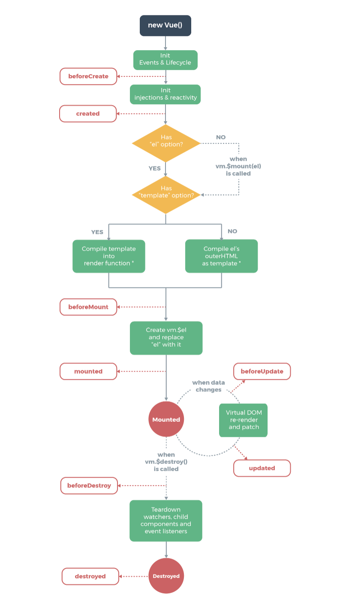

# VUE-study
## Vue
- v-text  
- v-html   
- v-bind:属性绑定  v-bind:href="" 缩写 :href="" ，可以绑定class     
- v-on: 事件绑定  v-on:click 缩写 @click    
- 条件渲染：  
	- v-if:如果不满足，就不会存在在dom节点中  
	- v-show：如果不满足条件，依旧在dom节点中，只是display:none   
	- v-else 与v-if相反    
- v-model  表单的数据双向绑定  
- v-for 

	```
	<p v-for="(item, index) in list" :class="{odd: index%2}">{{item.name}}-{{item.price}}-{{index}}</p>
	<p v-for="(value, key) in objList">{{key}} - {{value}}</p>
	```
- 数组更新:

	1. 可以触发视图更新的方法：
	
		- push()
		- pop()
		- shift()
		- unshift()
		- splice()
		- sort()
		- reverse()
	2. 不能触发视图更新的方法
		- concat()
		- slice()
		- filter()
		- 直接利用索引更改某一项
		- 直接修改索引的长度
		
		针对已经创建的实例，Vue不能直接动态添加根级别的响应式属性，但是可以使用Vue.set(object, key, value)方法向嵌套对象添加响应式属性
	
		```
		Vue.set(this.list, 1, {
		        name: 'orange',
		        price: 16
		      })
		this.list[1] = {
			name: 'orange',
			price: 16
		}//这种方式不可以，可以通过Vue.set()来修改
		```
		
- ref (string类型)

	用来给元素或子组件注册引用信息。引用信息将会注册在父组件的 $refs 对象上。如果在普通的 DOM 元素上使用，引用指向的就是 DOM 元素；如果用在子组件上，引用就指向组件实例：
	
	```
	<!-- vm.$refs.p will be the DOM node -->
	<p ref="p">hello</p>
	<!-- vm.$refs.child will be the child comp instance -->
	<child-comp ref="child"></child-comp>
	```
	当 v-for 用于元素或组件的时候，引用信息将是包含 DOM 节点或组件实例的数组。

	关于 ref 注册时间的重要说明：因为 ref 本身是作为渲染结果被创建的，在初始渲染的时候你不能访问它们 - 它们还不存在！$refs 也不是响应式的，因此你不应该试图用它在模板中做数据绑定。


- slot(string类型)

	用于标记往哪个具名插槽中插入子组件内容。
	子组件里使用<slot></slot>就可以把子组件标签里的结构引用到子组件里

### 生命周期

#### beforeCreate
在实例初始化之后，数据观测(data observer)和event/watcher事件配置之前被调用
#### created
实例创建完成后立即调用，实例已完成以下的配置：数据观测，属性和方法的运用，watch/event事件回调，挂载阶段还没开始，el属性不可见（就是data里的el还没有绑定到某个元素上）
#### 

### 父子组件通信：

- 引入子组件

```
import componentA from './components/a'  
components: {
    componentA: componentA
  },
```
- 子组件向父组件传递
在子组件里：
  
```
<button @click="emitMyEvent">emit</button>
methods: {
	emitMyEvent () {
		this.$emit('my-event', this.haha);
	}
}
```
父组件里：

```
<componentB @my-event="onComaMyEvent"></componentB>
```
vm.$emit()接收两个参数，第一个是父组件的事件名称，第二个参数是传参数。
 
 - 父组件向子组件传递数据  
	props:接收来自父组件的数据，可以是数组也可以是对象


computed  计算属性  
watch  监听属性变化  

## Vue-cli
### 优点：
1. 成熟的vue项目架构设计
2. 本地测试服务器
3. 集成打包上线的方案

### 安装  
> npm install vue-cli -g 安装  
vue init webpack my-project 初始化项目  
npm install 安装项目依赖  
npm run dev  在本地启动测试服务器  
npm run build 生成上线目录(部署)
>

### vue-router
### 引入的方式
1. 首先看package.json里有没有vue-router，如果没有  
	npm install vue-router --save
2. 在入口文件main.js里引入vue-router

	```
	import VRouter from 'vue-router'//引入  
	import Apple from './components/Apple'
	import Banana from './components/Banana'' 
	Vue.use(VRouter)//使用
	let router = new VRouter({
		mode: 'history',
		routes: [
			{
				path: '/Apple',
				component: Apple
			},
			{
				path: '/Banana',
				component: Banana
			}
		]
	}) //实例化
	new Vue({
	  el: '#app',
	  router,
	  template: '<App/>',
	  components: { App }
	})
	```

### router-link
router-link组件支持用户在具有路由功能的应用中，通过to属性指定目标地址，默认渲染成带有正确链接的a标签，可以通过配置tag属性生成别的标签。

```
<!-- 字符串 -->
<router-link to="home">Home</router-link>
<!-- 渲染结果 -->
<a href="home">Home</a>

<!-- 使用 v-bind 的 JS 表达式 -->
<router-link v-bind:to="'home'">Home</router-link>

<!-- 不写 v-bind 也可以，就像绑定别的属性一样 -->
<router-link :to="'home'">Home</router-link>

<!-- 同上 -->
<router-link :to="{ path: 'home' }">Home</router-link>

<!-- 命名的路由 -->
<router-link :to="{ name: 'user', params: { userId: 123 }}">User</router-link>

<!-- 带查询参数，下面的结果为 /register?plan=private -->
<router-link :to="{ path: 'register', query: { plan: 'private' }}">Register</router-link>
```
[具体的用法点击此链接](https://router.vuejs.org/zh-cn/api/router-link.html)
### 路由带参数

```
let router = new VRouter({
	mode: 'history',
	routes: [
		{
			path: '/Apple/:color',
			component: Apple
		},
		{
			path: '/Banana',
			component: Banana
		}
	]
});
```
在routes的path里加上:参数，在对应的组件里可以通过this.$route.params获取到路由的参数


## vue-resource

在main.js里

```
import VueResource from 'vue-resource'
Vue.use(VueResource)
```

在子组件里

```
GET请求
this.$http.get('getList').then(function (data) {
	console.log(data);
}, function (err) {
	console.log(err);
});
POST请求
this.$http.post('getList', {data: 1}).then(function (data) {
	console.log(data);
}, function (err) {
	console.log(err);
});
```

## VUE transition
### Props
1. name 字符串型 用于自动生成css过渡类名,假设起名字加name="fade"，自动拓展为.fade-enter,.fase-enter-active等，默认name为v
2. appear 布尔型，是否在初始渲染时使用过渡，默认为false
3. css 布尔型  是否使用css过渡类，默认为true，如果设置为false，将只能通过组件事件触发注册的javascript钩子
4. type 字符串型，过渡事件类型,transition或者animation
5. mode 字符串型  控制离开/进入的过渡时间序列,'out-in'和'in-out'

### 过渡的类名
在进入/离开的过渡中，有6个class切换

1. v-enter: 进入过渡的开始状态，在元素被插入时生效
2. v-enter-active: 定义过渡的状态，元素被插入时生效，在transition/animation完成之后移除
3. v-enter-to: 定义过渡结束的状态
4. v-leave: 离开过渡的开始状态，离开过渡被触发的时生效
5. v-leave-active: 离开过渡被触发后生效，在transition/animation完成之后移除
6. v-leave-to:离开过渡的结束状态


## VUEX
### 安装
进入文件目录  cnpm install vuex --save
### 使用
1. src文件夹里添加store文件夹,这个文件的结构是
	
	
	index.js里面的内容是：
	
	```
	import Vuex from 'vuex'
	import Vue from 'vue'
	import orderList from './modules/orderList'
	Vue.use(Vuex)
	export default new Vuex.Store({
		modules: {
			orderList
		}
	})
	```
2. main.js里引入store

	```
	import Store from './store'
	new Vue({
	  el: '#app',
	  router,
	  store,
	  template: '<Layout/>',
	  components: { Layout }
	})
	```
3. 在页面里，可以通过this.$store获取store这个对象


### vuex的应用场景
vuex是一个主要应用在中大型单页面应用的数据管理架构，举个例子：有一个父组件，它有两个子组件，如果父组件要向子组件里传递数据可以用props，但是如果这两个子组件之间需要数据共享，子组件向父组件传递数据。这里就需要使用自定义事件，通过this.$emit('my-event', data);将数据传给父组件  
=>这里有一个问题，就是当这个应用的规模的扩大：
	- 当一个组件里有子组件，子组件里还有子组件，这样大型复杂的嵌套的组件，追踪是哪个组件触发，谁在监听它就更复杂
	- 当业务的逻辑遍布各个组件
	- 显示地分发和监听事件，父组件和子组件强耦合
	
### vuex状态说明


## 商城项目练习
###注意事项
1. 在子组件里的css样式用style标签时，使用scope，这样子组件里的样式设置不会影响父组件
	
	```
	<style scoped>
	</style>
	```
2. 搭建测试环境 json-server （缺点只能通过get方式获取请求）

	```
	npm install json-server --save
	```
	在bulid文件夹下的dev-server.js里添加代码
	
	```
	var jsonServer = require('json-server');
	var apiServer = jsonServer.create();
	var apiRouter = jsonServer.router('db.json');
	var middlewares = jsonServer.defaults();
	apiServer.use(middlewares);
	apiServer.use('/api',apiRouter);
	apiServer.listen(port+1, function (err) {
	  if (err) {
	    console.log(err);
	    return 
	  }
	  console.log('Listening at http://localhost:' + (port+1));
	});
	```
	在config文件夹的index.js里添加proxyTable里异步请求的路径
	
3. 注意当端口号之前被占用了 想要取消的话

	```
	lsof -i:端口号
	kill -9 端口id
	```

4. 在js里给子组件传参数时，要是引入图片之类的静态资源，要用require(这里webpack规则)
5. 使用vue实现选项卡
	- 样式: 向下箭头
		利用border属性可以实现：
		
		```
		border-top: 5px solid #e3e3e3;
		border-left: 5px solid transparent;
		border-right: 5px solid transparent;
		border-bottom: 5px solid transparent;
		```
		设置其中三个方向的颜色设为transparent
	- 父子组件之间传值
	
		- 父组件传给子组件
		
			> 父组件通过属性传给子组件 :属性
			
			> ```
			<v-selection :selection="productType" @on-change=""></v-selection>
			```
			> 子组件接收 使用props
			
			> ```
				props: {
					selection: {
						type: Array,
						default: [{
							label: 'test',
							value: 0
						}]
					}
				}
			> ```
		
		- 子组件传给父组件
		
			> ```
			>this.$emit('on-change', this.nowIndex);
			>```
			
	- 实现功能说明：
		- 点击可见区域的span,底下的ul展示
		- 点击ul底下的li，可见区域的内容变成li的内容
		- 子组件将选中的index传给父组件
	- 代码
	
	 ```
	<div class="selection-show" @click="toggle">
		<span>{{ selection[nowIndex].label }}</span>
		<div class="arrow"></div>
	</div>
	<div class="selection-list" v-if="isDrop">
		<ul>
			<li v-for="(item, index) in selection" @click="chooseSeclection(index)">{{ item.label }}</li>
		</ul>
	</div>
	<script>
		export default {
			props: {
				selection: {
					type: Array,
					default: [{
						label: 'test',
						value: 0
					}]
				}
			},
			data () {
				return {
					isDrop: false,
					nowIndex: 0
				}
			},
			methods: {
				toggle () {
					this.isDrop = !this.isDrop;
				},
				chooseSeclection (index) {
					this.nowIndex = index;
					this.isDrop = false;
					this.$emit('on-change', this.nowIndex);
				}
			}
		}
	</script>
	```
6. 使用vue实现路由跳转
	
	```
	import Vue from 'vue'
	import Layout from './components/layout'
	import VueRouter from 'vue-router'
	import VueResource from 'vue-resource'
	import IndexPage from './pages/index'
	import DetailPage from './pages/detail'
	import CountPage from './pages/detail/count'
	import ForecastPage from './pages/detail/forecast'
	import AnalysisPage from './pages/detail/analysis'
	import PublishPage from './pages/detail/publish'
	
	Vue.use(VueRouter)
	Vue.use(VueResource)
	let router = new VueRouter({
		mode: 'history',
		routes: [
			{
				path: '/',
				component: IndexPage
			},
			{
				path: '/detail',
				component: DetailPage,
				redirect: '/detail/analysis',
				children: [
					{
						path: 'count',
						component: CountPage
					},
					{
						path: 'forecast',
						component: ForecastPage
					},
					{
						path: 'analysis',
						component: AnalysisPage
					},
					{
						path: 'publish',
						component: PublishPage
					}
				]
			}
		]
	})
	```
这里注意的就是 children孩子结点的path直接使用count,不能使用'/count',/会直接找到根路径目录

## 音乐app练习
### 配置
1. 目录文件：src分成了api,common,components,router,store五个文件夹
	
	- api放异步数据接口
	- common 公共静态资源
	- components 小插件
	- router 路由
	- store vuex仓库
	
2. 在main.js文件里引入了common里的资源，所以需要在bulid下的webpack.base.conf.js文件里配置一个资源路径

	```
	 resolve: {
	    extensions: ['.js', '.vue', '.json'],
	    alias: {
	      'src': resolve('src'),
	      'common': resolve('src/common')
	    }
	  },
	```
	这个地方需要尤其注意, *使用绝对路径就需要在webpack.base.conf.js里设置*
	
3. 移动端安装插件fastclick，这个防止click点击300ms的延时，使用方法是在main.js里引入

	```dash
	import fastclick from 'fastclick'
	fastclick.attach(document.body);
	```
	
### router 配置
1. 在router里的index.js里引入各个组件，配置routes

	```
	import Vue from 'vue'
	import Router from 'vue-router'
	import Recommend from 'components/recommend/recommend'
	import Singer from 'components/singer/singer'
	import Rank from 'components/rank/rank'
	import Search from 'components/search/search'
	Vue.use(Router)
	export default new Router({
	  routes: [
	  	{
	  		path: '/',
	  		redirect: '/recommend'
	  	},
	    {
	    	path: '/recommend',
	    	component: Recommend
	    },
	    {
	    	path: '/singer',
	      	component: Singer
	    },
	    {
	    	path: '/rank',
	      	component: Rank
	    },
	    {
	    	path: '/search',
	      	component: Search
	    }
	  ]
	})
	```
	
2. 在要使用route路由的vue文件里使用<router-link>

	```
	<router-link tag="div" class="tab-item" to="/recommend">
		<span class="tab-link">推荐</span>
	</router-link>
	<router-link tag="div" class="tab-item" to="/singer">
		<span class="tab-link">歌手</span>
	</router-link>
	<router-link tag="div" class="tab-item" to="/rank">
		<span class="tab-link">排行</span>
	</router-link>
	<router-link tag="div" class="tab-item" to="/search">
		<span class="tab-link">搜索</span>
	</router-link>
	```
3. 在App.vue文件，要引入的组件里使用<router-view></router-view>

## jsonp应用
这里音乐app是抓包qq音乐的异步接口，使用的jsonp的方式。首先npm安装jsonp包

```
npm install jsonp --save
```
在本地封装jsonp方法

```
export default function jsonp (url, data, option) {
	url += (url.indexOf('?') < 0 ? '?' : '&') + param(data)
	return new Promise((resolve, reject) => {
		originJSONP(url, option, (err, data) => {
			if (!err) {
				resolve(data)
			} else {
				reject(err)
			}
		})
	})
}

function param (data) {
	let url = ''
	for (var k in data) {
		let value = data[k] !== undefined ? data[k] : ''
		url += `&${k}=${encodeURIComponent(value)}`
	}
	return url ? url.substring(1) : ''
}
```