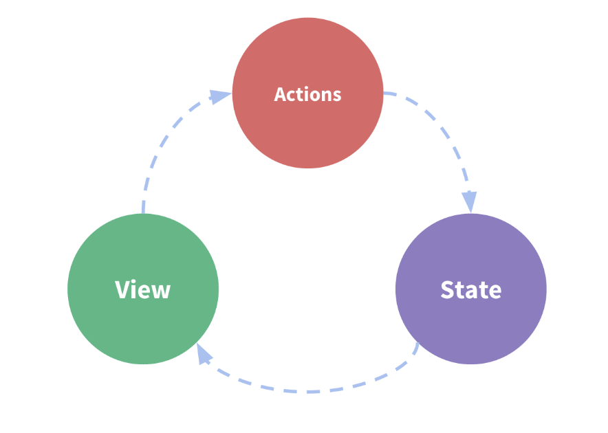
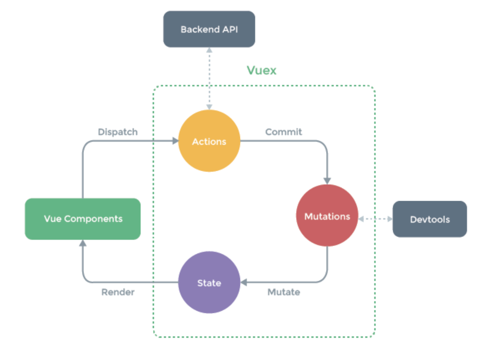

# vuex的整理
## vuex是什么
专门为vue.js应用程序开发的**状态管理模式**


- state 存放共享数据
- view 视图
- Actions 在view上用户的行为需要同步修改state中的共享数据，这里就是响应view上的用户输入导致的变化

在实际的操作中，会遇到如下情况：
> 多个视图依赖于同一状态  
> 来自不同视图的用户行为需要变更同一个状态。

这样，我们提出将**组件的共享状态**抽取出来，以**全局单例模式**进行管理。其数据响应机制如下图所示：

下面详细介绍一下vuex的核心概念
### State
**单一状态树**就是存放一些数据，这些数据在很多组件中可能都需要。  
Vuex通过store选项，将该机制从根组件注入到每一个组件中，在store/index.js里需要调用Vue.use(Vuex)。  

**这样在每个组件中都可以获取store的方法有两种：**
  
- 直接使用this.$store.state.count来获取
- 在组件中import store from '~common/store/'，然后使用store.state.count来获取

#### 示例
首先使用vuex时，新建一个store文件夹。在该文件夹里有一个index.js文件。   

```js
//在main.js里引用
import store from '~common/store/'

//store/index.js里
import Vue from 'vue'
import Vuex from 'vuex'
import actions from './actions'
import mutations from './mutations'
Vue.use(Vuex)
const state = {
	count
}
export default new Vuex.Store({
    state,
    actions,
	 mutations
})
```
### Getter
可以理解为对state里的数据进行一个计算得到新的值，这个值可能在多个组件中会经常用到，那我们就像计算属性一样，getter 的返回值会根据它的依赖被缓存起来，且只有当它的依赖值发生了改变才会被重新计算。就像计算属性一样，getter的返回值会根据它的依赖被缓存起来，只有当它的依赖值发生改变才会重新计算。其可以通过不同的方式进行访问，具体可以看[vue文档](https://vuex.vuejs.org/zh/guide/getters.html)。
### Mutation
**更改Vuex的store中的状态的唯一方法就是提交mutation**


