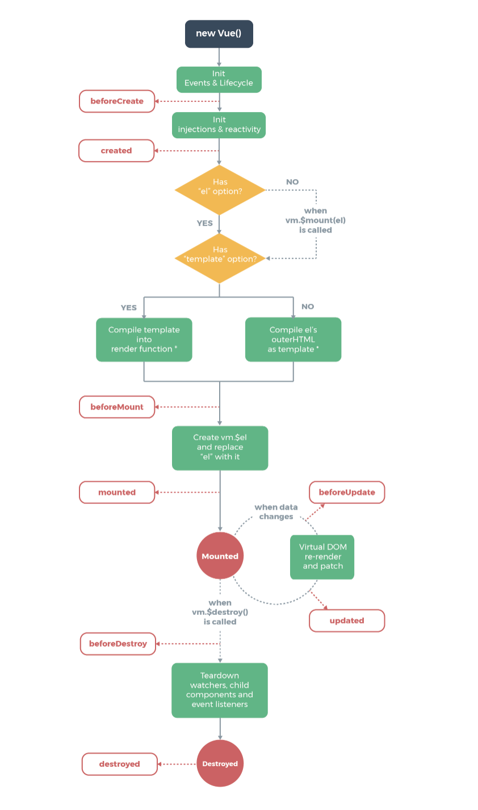
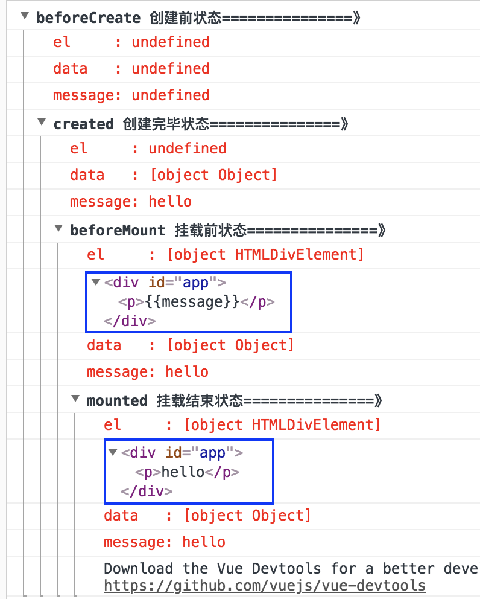

# vue 生命周期


1. 生命周期过程中，首先创建vue实例，然后初始化事件并监测数据。在created阶段之前就完成了数据的监测（这个阶段data和data的属性已存在，但是el未初始化）  
2. created函数触发后，开始初始化el，并且编译template。在created和beforeMount这两个阶段之间发生的事情比较多：  
	（1） 首先判断对象是否有el选项，有的话向下编译，没有的话，则停止编译，也就意味着停止了生命周期，直到在该vue实例上调用vm.$mount(el)。  
	（2） template参数选项是否对生命周期有影响：  
		- 如果vue实例对象中有template参数选项，则将其作为模板编译成render函数。  
		- 如果没有template选项，则将外部HTML作为模板编译。  
       - 可以看到template中的模板优先级要高于outer HTML的优先级。
    
		

vue2.0 | 描述 
:--- | :---   
beforeCreate | 组建实例化刚被创建，该过程在组件属性计算之前，在这个时候data和el,以及自定义的message都是undefined
created  | 组件实例化创建完成，属性已绑定，但是dom还未生成，$el属性还不存在,在这个时候data和message已经初始化了
beforeMount | 模板编译/挂载之前 $el和data、message都被初始化了
mounted | 模板编译/挂载之后 $el和data、message都被初始化了
beforeUpdate | 组件更新之前
updated | 组件更新之后
activated | keep-alive,组件激活时被调用
deactivated | keep-alive,组件移除时被调用
beforeDestory | 组件销毁前被调用
destory | 组件销毁后被调用

```
<!DOCTYPE html>
<html lang="en">
<head>
	<meta charset="UTF-8">
	<title>vue生命周期</title>
	<script type="text/javascript" src="https://cdn.jsdelivr.net/vue/2.1.3/vue.js"></script>
</head>
<body>
	<div id="app">
		<p>{{message}}</p>
		<button v-on:click="change">点击改变值</button>
	</div>
	<script type="text/javascript">
		new Vue({
			el: '#app',
			data: {
				message: 'hello'
			},
			methods: {
				change: function () {
					this.message = this.message.split('').reverse().join('');
				}
			},
			beforeCreate: function () {
	            console.group('beforeCreate 创建前状态===============》');
	            console.log("%c%s", "color:red" , "el     : " + this.$el); //undefined
	            console.log("%c%s", "color:red","data   : " + this.$data); //undefined 
	            console.log("%c%s", "color:red","message: " + this.message)  
        	},
        	created: function () {
            	console.group('created 创建完毕状态===============》');
            	console.log("%c%s", "color:red","el     : " + this.$el); //undefined
                console.log("%c%s", "color:red","data   : " + this.$data); //已被初始化 
                console.log("%c%s", "color:red","message: " + this.message); //已被初始化
	        },
	        beforeMount: function () {
	            console.group('beforeMount 挂载前状态===============》');
	            console.log("%c%s", "color:red","el     : " + (this.$el)); //已被初始化
	            console.log(this.$el);
	            console.log("%c%s", "color:red","data   : " + this.$data); //已被初始化  
	            console.log("%c%s", "color:red","message: " + this.message); //已被初始化  
	        },
         	mounted: function () {
            	console.group('mounted 挂载结束状态===============》');
            	console.log("%c%s", "color:red","el     : " + this.$el); //已被初始化
            	console.log(this.$el);    
                console.log("%c%s", "color:red","data   : " + this.$data); //已被初始化
                console.log("%c%s", "color:red","message: " + this.message); //已被初始化 
        	},
        	beforeUpdate: function () {
            	console.group('beforeUpdate 更新前状态===============》');
            	console.log("%c%s", "color:red","el     : " + this.$el);
            	console.log(this.$el);   
               	console.log("%c%s", "color:red","data   : " + this.$data); 
               	console.log("%c%s", "color:red","message: " + this.message); 
        	},
        	updated: function () {
            	console.group('updated 更新完成状态===============》');
           		console.log("%c%s", "color:red","el     : " + this.$el);
            	console.log(this.$el); 
               	console.log("%c%s", "color:red","data   : " + this.$data); 
               	console.log("%c%s", "color:red","message: " + this.message); 
        	},
        	beforeDestroy: function () {
            	console.group('beforeDestroy 销毁前状态===============》');
            	console.log("%c%s", "color:red","el     : " + this.$el);
            	console.log(this.$el);    
               	console.log("%c%s", "color:red","data   : " + this.$data); 
               	console.log("%c%s", "color:red","message: " + this.message); 
        	},
        	destroyed: function () {
            	console.group('destroyed 销毁完成状态===============》');
            	console.log("%c%s", "color:red","el     : " + this.$el);
            	console.log(this.$el);  
               	console.log("%c%s", "color:red","data   : " + this.$data); 
               	console.log("%c%s", "color:red","message: " + this.message)
        	}
		})
	</script>
</body>
</html>
```

**mounted和beforeMount这两种情况$el和data、message都被初始化了，但是其有一定的区别，beforeMount时应用虚拟Dom先把坑粘住了。mounted是挂载后的情况，在该阶段的时候，把值渲染进去。在beforeUpdate,可以监听到data的变化但是view层没有被重新渲染，view层的数据没有变化。等到updated的时候 view层才被重新渲染，数据更新。**如下图所示。


## 总结
beforeCreated：该状态在new Vue()之后，但这个阶段el,data，以及data内部的赋值都没有初始化。  
created: 该状态数据已经被检测到了，data和data内部的值都可以取到，但是el还没有初始化  
beforeMount:挂载前，这个时候el已经初始化了，但是dom结构内的使用data引用的值还没有被渲染  
Mounted:挂载后，dom结构内的使用data引用的值已经被渲染  


